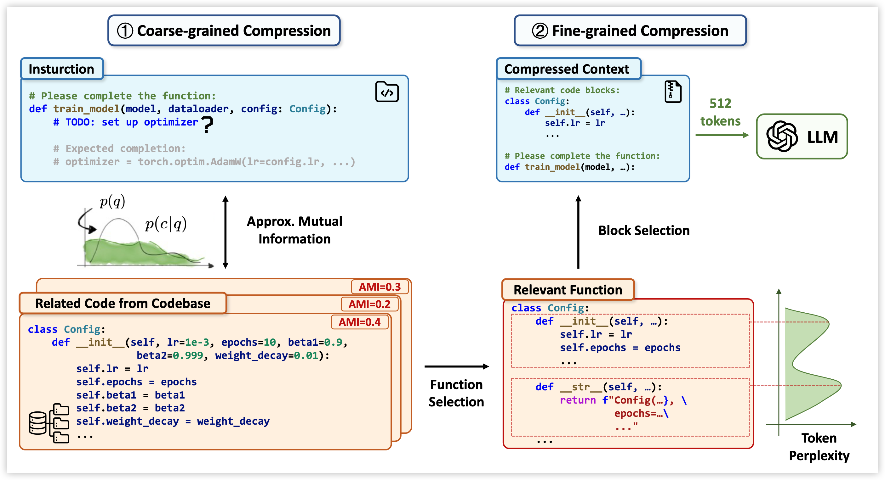

<div align="center">
  

[](https://arxiv.org/abs/2510.00446) [](https://conf.researchr.org/details/ase-2025/ase-2025-papers/121/LongCodeZip-Compress-Long-Context-for-Code-Language-Models) [](https://www.python.org/downloads/release/python-397/) [](https://github.com/YerbaPage/LongCodeZip) [](LICENSE)

</div>

# LongCodeZip

This repository is the official implementation of LongCodeZip, a novel two-stage long code compression method. Our paper "LongCodeZip: Compress Long Context for Code Language Models" has been accepted to **ASE 2025**.

## Method Overview



LongCodeZip introduces a two-stage code compression framework specifically designed for code LLMs:

1. **Coarse-grained Compression**: Function-based chunking and ranking using conditional perplexity with respect to the query to select the most relevant functions.

2. **Fine-grained Compression**: Entropy-based block detection combined with 0/1 knapsack optimization to maximize relevance within adaptive token budgets.

The method is plug-and-play and can be integrated with existing code LLMs to achieve significant compression ratios while maintaining or improving task performance.

## Repository Structure

This repository contains implementations and experiments for three code-related tasks:

```
LongCodeZip/
├── repo-qa/                   # Code Retrieval Task
│   ├── main.py               # Main evaluation script
│   ├── run.sh                # Experiment runner
│   ├── code_compressor.py    # Core compression implementation
│   ├── compute_score.py      # Evaluation metrics
│   └── ...
├── long-code-completion/      # Code Completion Task
│   ├── main.py               # Main evaluation script
│   ├── run.sh                # Experiment runner
│   ├── code_compressor.py    # Core compression implementation
│   ├── utils.py              # Utility functions
│   └── ...
├── module-summarization/      # Code Summarization Task
│   ├── main.py               # Main evaluation script
│   ├── run.sh                # Experiment runner
│   ├── code_compressor.py    # Core compression implementation
│   ├── utils.py              # Utility functions
│   └── ...
└── README.md
```

## Installation

```bash
pip install -r requirements.txt
```

## Quick Demo

We provide a simple demo (`demo.py`) to help you get started with LongCodeZip:

```bash
python demo.py
```

This demo showcases the core compression functionality by compressing a simple code snippet containing multiple functions (add, quick_sort, search_with_binary_search) based on a query about quick sort. The compressor will:
1. Rank functions by relevance to the query
2. Apply fine-grained compression to maximize information density
3. Generate a compressed prompt suitable for code LLMs

**Example output:**
```python
# Original: ~150 tokens
# Compressed: ~64 tokens (target)
# Selected: quick_sort function (most relevant to query)
```

## Core API Usage

LongCodeZip provides a simple and powerful API for compressing long code contexts. Here's how to use it:

### Basic Example

```python
from longcodezip import CodeCompressor

# Initialize the compressor
compressor = CodeCompressor(model_name="Qwen/Qwen2.5-Coder-7B-Instruct")

# Compress code with a query
result = compressor.compress_code_file(
    code=your_code_string,
    query="What does this function do?",
    instruction="Answer the question based on the code.",
    rate=0.5,  # Keep 50% of tokens
)

# Access compressed results
compressed_code = result['compressed_code']
compressed_prompt = result['compressed_prompt']  # Full prompt with instruction
compression_ratio = result['compression_ratio']
```
## Usage

### Quick Start

Each task directory contains a `run.sh` script for easy experimentation. Simply navigate to the desired task directory and run:

```bash
cd <task_directory>
bash run.sh
```

### Code Retrieval (RepoQA)

Navigate to the `repo-qa` directory and run experiments with different compression ratios:

```bash
cd repo-qa
bash run.sh
```

The script will evaluate LongCodeZip on the RepoQA dataset with compression ratios, running experiments in parallel on multiple GPUs.

**Key Parameters:**
- `--compression-ratio`: Controls the compression level
- `--model`: Specifies the base LLM model
- `--backend`: Backend for model inference (vllm)

### Code Completion

Navigate to the `long-code-completion` directory:

```bash
cd long-code-completion
bash run.sh
```

## References

```bibtex
@article{shi2025longcodezip,
  title={LongCodeZip: Compress Long Context for Code Language Models},
  author={Shi, Yuling and Qian, Yichun and Zhang, Hongyu and Shen, Beijun and Gu, Xiaodong},
  journal={arXiv preprint arXiv:2510.00446},
  year={2025}
}
```